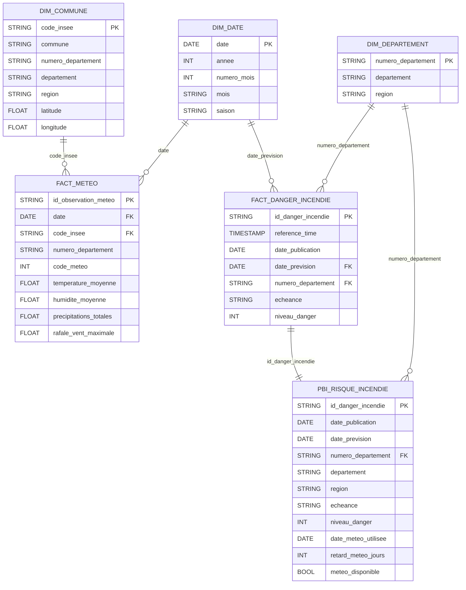

# Schéma des données Fourcasters

Ce schéma présente les principales tables d'analyse construites par dbt dans BigQuery.

## Modèle principal



## Lecture simple

- **dim_commune** décrit les 360 points météo du projet.
- **dim_departement** contient les 96 départements métropolitains.
- **dim_date** sert de calendrier commun.
- **fact_meteo** contient une observation météo par point et par jour.
- **fact_danger_incendie** contient une ligne par publication, département et échéance J1/J2.
- **pbi_risque_incendie** est une table plate préparée spécialement pour Power BI.

Une commune possède plusieurs observations météo dans le temps : relation **1,N** entre `dim_commune` et `fact_meteo`.

Un département possède plusieurs prévisions de danger : relation **1,N** entre `dim_departement` et `fact_danger_incendie`.

## Tables Machine Learning

Les tables ML sont séparées du modèle d'analyse principal :

```text
int_meteo_departement_jour
          |
          v
ml_features_incendie
          |
          +---- fact_danger_incendie
                    |
                    v
             ml_train_incendie
                    |
                    v
              pipeline.pkl
```

- `ml_features_incendie` prépare les variables météo des 7 derniers jours connus au moment de la publication, de D-6 à D.
- `ml_train_incendie` ajoute la cible Météo-France : J1 = D+1 et J2 = D+2.
- Ces tables servent à l'entraînement du modèle et ne remplacent pas les tables Power BI.
