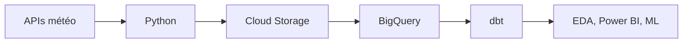

# Fourcasters

[](https://github.com/Thymael/Projet-Fourcasters/actions/workflows/pipeline.yml)

Projet de fin de formation Data Analyst à la Wild Code School.

Fourcasters rapproche la météo historique et le danger d'incendie en France
métropolitaine. Le but est de préparer des données fiables pour l'EDA, Power BI
et un futur modèle de Machine Learning.

## Les données

| Source | Contenu | Grain |
|---|---|---|
| Open-Meteo (`ERA5-Seamless`) | Observations météo quotidiennes | 360 points par jour |
| Météo-France, Météo des forêts | Danger prévu à J1 et J2 | 96 départements par publication |
| Archives Météo-France | Danger incendie depuis 2024 | 96 départements par publication |

Le niveau Météo-France indique un **danger prévu**. Il ne correspond pas au
nombre de feux réellement observés.

## Fonctionnement



Le workflow GitHub Actions lance chaque jour :

1. la collecte Open-Meteo ;
2. la collecte Météo-France ;
3. le chargement dans BigQuery ;
4. la construction et les tests des modèles dbt.

Les principales tables finales sont :

- `dim_date`, `dim_commune` et `dim_departement` ;
- `fact_meteo` ;
- `fact_danger_incendie`.

## Organisation

```text
fourcasters/              modèles et tests dbt
scripts/                  scripts à lancer
src/fourcasters_dbt/      fonctions Python du pipeline
DOCUMENTATION/            contrôles et choix du projet
.github/workflows/        automatisation quotidienne
```

Le fichier `scripts/actualiser_fourcasters.py` contient les deux orchestrations
principales. Les fonctions métier restent séparées dans `src/` pour garder des
fichiers lisibles.

## Installation locale

Prérequis : Python 3.12, `uv`, une clé GCP et une API Key Météo-France.

```bash
uv sync
cp .env.example .env
```

Renseigner ensuite les deux valeurs dans `.env`. Ce fichier et les clés GCP sont
ignorés par Git.

Pour lancer dbt en local, ajouter aussi un profil `fourcasters` dans
`~/.dbt/profiles.yml` avec le projet BigQuery `fourcasters-openmeteo-loick`.

## Commandes utiles

```bash
# Pipeline complet
uv run python scripts/actualiser_fourcasters.py

# Une seule source
uv run python scripts/actualiser_fourcasters.py --openmeteo-only
uv run python scripts/actualiser_fourcasters.py --incendie-only

# Test local de l'API incendie, sans envoi dans GCP
uv run python scripts/actualiser_fourcasters.py --incendie-only --local-only

# Modèles et tests dbt
uv run dbt build --project-dir fourcasters
```

L'historique Météo-France est un import ponctuel :

```bash
uv run python scripts/importer_archives_meteofrance.py --local-only
uv run python scripts/importer_archives_meteofrance.py
```

## Contrôles

Le pipeline vérifie les colonnes obligatoires, les volumes attendus et les
doublons avant de mettre à jour l'historique. Les tests dbt contrôlent ensuite
les clés, les valeurs et les relations entre les tables.

Les requêtes de vérification manuelle sont dans
[`DOCUMENTATION/CONTROLES_BIGQUERY_FOURCASTERS.sql`](DOCUMENTATION/CONTROLES_BIGQUERY_FOURCASTERS.sql).
Les conventions de code et les risques du projet sont résumés dans les deux
autres fichiers du dossier `DOCUMENTATION/`.

## État du projet

- ingestion et actualisation quotidienne : opérationnelles ;
- modèle en étoile dbt : opérationnel ;
- EDA, rapport Power BI et préparation ML : prochaines étapes.

## Auteur

**MARTIN Loïck**

Projet Data Analyst — Wild Code School
