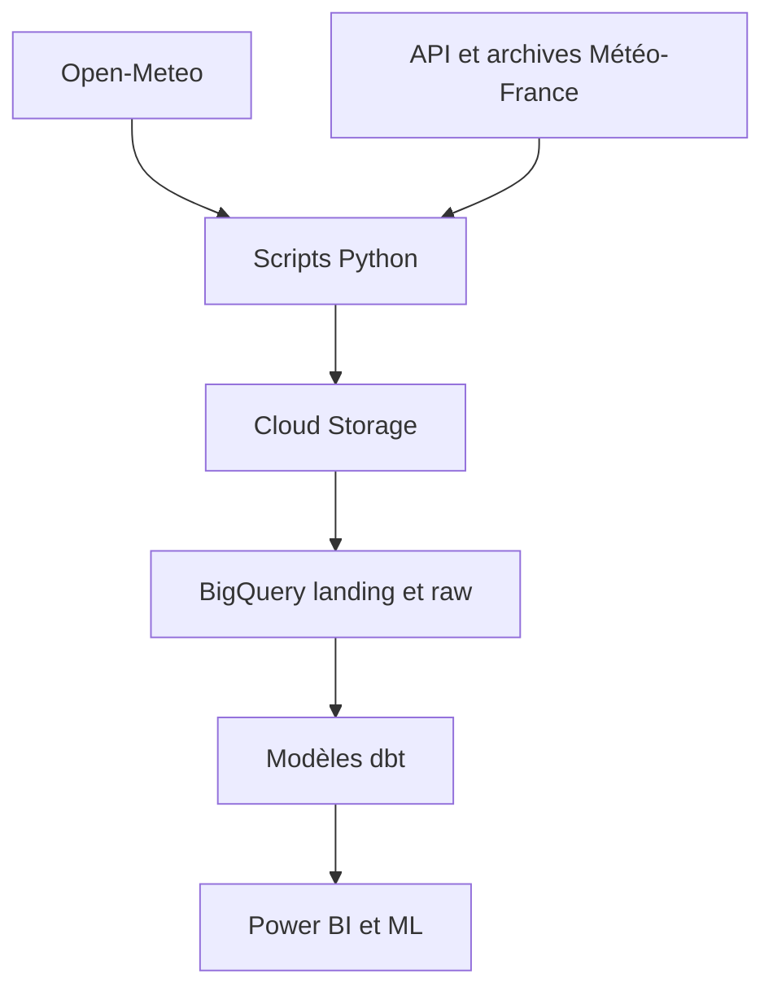

# Fourcasters

Projet de fin de formation Data Analyst réalisé à la Wild Code School.

Fourcasters collecte des données météo françaises afin d'étudier les conditions
associées aux canicules, aux fortes précipitations et au danger d'incendie. Les
données sont préparées pour BigQuery, dbt, Power BI et de futurs modèles de
Machine Learning.

## Données utilisées

| Source | Contenu | Granularité |
|---|---|---|
| Open-Meteo Historical (`ERA5-Seamless`) | Observations météo quotidiennes | 360 points × jour |
| API Météo-France « Météo des forêts » | Danger incendie courant prévu à J1 et J2 | 96 départements × publication |
| Archives Météo-France | Historique du danger incendie depuis 2024 | 96 départements × publication |

Les niveaux Météo-France représentent un **danger prévu** et non des départs de
feu observés.

## Pipeline



Principales tables :

- `openmeteo_raw.meteo_journaliere` : historique météo ;
- `meteofrance_raw.meteo_forets` : historique du danger incendie ;
- `openmeteo_analyse.dim_commune` et `dim_date` : dimensions ;
- `openmeteo_analyse.fact_meteo` : faits météo.

Les modèles dbt `dim_departement` et `fact_danger_incendie` complètent le volet
incendie.

## Organisation

```text
Projet_Fourcasters/
├── fourcasters/             # projet dbt
├── scripts/                 # point d'entrée quotidien et import historique
├── src/fourcasters_dbt/     # fonctions Python rangées par thème
├── DOCUMENTATION/           # choix techniques et livrables
├── data/                    # fichiers locaux générés, non versionnés
├── pyproject.toml
└── README.md
```

## Installation

Depuis la racine du dépôt :

```bash
uv sync
```

Configurer ensuite :

- la clé Google Cloud avec `GOOGLE_APPLICATION_CREDENTIALS` ;
- l'API Key Météo-France dans `.env` :

```text
METEOFRANCE_API_KEY=valeur_secrete
```

Les fichiers `.env`, `profiles.yml` et les clés GCP ne doivent jamais être
ajoutés à Git.

## Lancer les traitements

```bash
# Actualisation complète : météo puis incendie
uv run python scripts/actualiser_fourcasters.py

# Lancer seulement Open-Meteo si besoin
uv run python scripts/actualiser_fourcasters.py --openmeteo-only

# Lancer seulement l'incendie
uv run python scripts/actualiser_fourcasters.py --incendie-only

# Tester l'incendie sans envoi dans Google Cloud
set -a
source .env
set +a
uv run python scripts/actualiser_fourcasters.py --incendie-only --local-only

# Construction et tests dbt
uv run dbt build --project-dir fourcasters
```

Le pipeline contrôle notamment la volumétrie attendue, les doublons, les
colonnes obligatoires et les clés `row_hash`. Une collecte incomplète bloque le
chargement suivant.

Les fonctions `main_openmeteo()` et `main_incendie()` sont regroupées dans
`scripts/actualiser_fourcasters.py`. Les modules du dossier `src/` contiennent
uniquement les fonctions métier utilisées par ces deux orchestrations.

## Importer l'historique incendie

Météo-France fournit des fichiers annuels depuis 2024. Cet import est ponctuel :
il ne fait pas partie du workflow quotidien et ne demande pas d'API Key.

```bash
# Vérifier le téléchargement et créer le Parquet local
uv run python scripts/importer_archives_meteofrance.py --local-only

# Charger toutes les archives disponibles dans BigQuery
uv run python scripts/importer_archives_meteofrance.py

# Importer seulement certaines années si besoin
uv run python scripts/importer_archives_meteofrance.py --annees 2024 2025
```

Le script harmonise les différents noms de colonnes utilisés selon les années,
contrôle les 96 départements, puis réutilise le `MERGE` de la collecte
quotidienne. Il peut donc être relancé sans créer de doublon.

Après l'import, reconstruire les tables analytiques :

```bash
uv run dbt build --project-dir fourcasters
```

## Documentation

- `DOCUMENTATION/REGLES_CLEAN_CODE.md` : règles de développement et méthode de
  refactorisation ;
- `DOCUMENTATION/CONTROLES_BIGQUERY_FOURCASTERS.sql` : contrôles principaux ;
- la documentation dbt peut être générée avec
  `uv run dbt docs generate --project-dir fourcasters`.

## Auteur

**MARTIN Loïck**

Projet de fin de formation Data Analyst — Wild Code School
