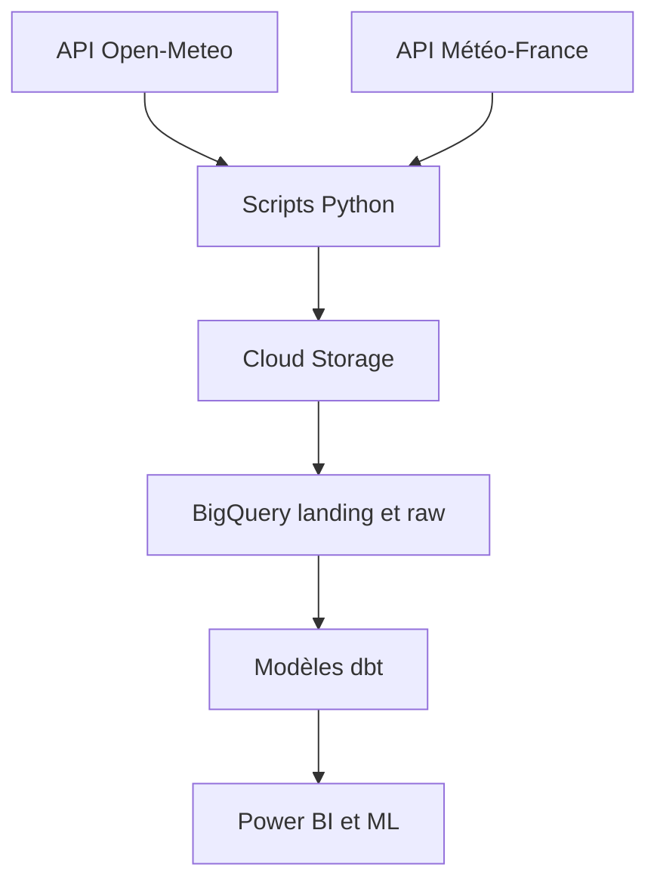

# Fourcasters

Projet de fin de formation Data Analyst réalisé à la Wild Code School.

Fourcasters collecte des données météo françaises afin d'étudier les conditions
associées aux canicules, aux fortes précipitations et au danger d'incendie. Les
données sont préparées pour BigQuery, dbt, Power BI et de futurs modèles de
Machine Learning.

## Données utilisées

| Source | Contenu | Granularité |
|---|---|---|
| Open-Meteo Historical (`ERA5-Seamless`) | Observations météo quotidiennes | 360 points × jour |
| Météo-France « Météo des forêts » | Danger incendie prévu à J1 et J2 | 96 départements × publication |

Les niveaux Météo-France représentent un **danger prévu** et non des départs de
feu observés.

## Pipeline



Principales tables :

- `openmeteo_raw.meteo_journaliere` : historique météo ;
- `meteofrance_raw.meteo_forets` : historique du danger incendie ;
- `openmeteo_analyse.dim_commune` et `dim_date` : dimensions ;
- `openmeteo_analyse.fact_meteo` : faits météo.

Les modèles dbt `dim_departement` et `fact_danger_incendie` sont la prochaine
étape du volet incendie.

## Organisation

```text
Projet_Fourcasters/
├── fourcasters/             # projet dbt
├── scripts/                 # points d'entrée des collectes
├── src/fourcasters_dbt/     # fonctions Python rangées par thème
├── DOCUMENTATION/           # choix techniques et livrables
├── data/                    # fichiers locaux générés, non versionnés
├── pyproject.toml
└── README.md
```

## Installation

Depuis la racine du dépôt :

```bash
uv sync
```

Configurer ensuite :

- la clé Google Cloud avec `GOOGLE_APPLICATION_CREDENTIALS` ;
- l'API Key Météo-France dans `.env` :

```text
METEOFRANCE_API_KEY=valeur_secrete
```

Les fichiers `.env`, `profiles.yml` et les clés GCP ne doivent jamais être
ajoutés à Git.

## Lancer les traitements

```bash
# Actualisation météo
uv run python scripts/actualiser_openmeteo.py

# Test incendie sans envoi dans Google Cloud
set -a
source .env
set +a
uv run python scripts/actualiser_meteofrance_incendie.py --local-only

# Construction et tests dbt
uv run dbt build --project-dir fourcasters
```

Le pipeline contrôle notamment la volumétrie attendue, les doublons, les
colonnes obligatoires et les clés `row_hash`. Une collecte incomplète bloque le
chargement suivant.

## Documentation

- `DOCUMENTATION/REGLES_CLEAN_CODE.md` : règles de développement et méthode de
  refactorisation ;
- la documentation dbt peut être générée avec
  `uv run dbt docs generate --project-dir fourcasters`.

## Auteur

**MARTIN Loïck**

Projet de fin de formation Data Analyst — Wild Code School
